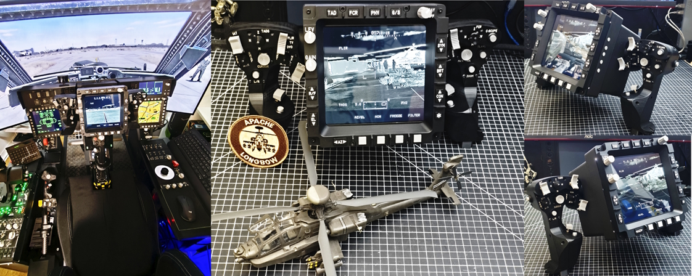

# AH-64D-Apache TEDAC (v2.0)

This is the successor to my old 7-inch TEDAC. This time I slapped the same 8" panel into the TDU (TEDAC Display Unit) that I’m using for my MPDs. For VR users, an actual LCD screen doesn’t make much sense - that’s why I’ve included a extra STL file for 3D printing
 The whole thing is part of my CP/G front panel for my modular cockpit setup. The CP/G panel, including the EUFD and Armament Panel, will drop as its own project soon (two weeks™).
 
Anyway, back to the TEDAC. Originally I designed the TDU for Hannibal’s TEDAC grips. Then my brain went “nah, we’re going deeper” and I ended up designing my own grips as well. They’re 1:1 scale to the real Apache grips with similar ergonomics, and yes, just like the real deal they rotate/adjust. That makes the TEDAC extreme flexible - throw it in a cockpit, or just park it on your desk. I made a bunch of mounts/stands for different setups.

For the grips I also designed my own integrated trigger setup, plus custom 4-way HAT switches

I also made a standalone version of the grips that works without my TEDAC. Same bolt pattern as Hannibal’s grips, so you can drop them into existing projects without having an aneurysm.

Build difficulty: extremely low-tier. You don’t need to code, and you don’t need EE knowledge. A 3D printer (or print service) + a soldering iron = done.

For the electronics I went with Leo Bodnar boards because they “just work”. The boards are automatically recognized by Windows as USB game devices, and the buttons can simply be assigned in DCS. If you prefer Arduino, that’s also an option.

Labeling was done with a diode laser. All laser files are included. If you can’t laser, I also included STL variants with raised text - just hit the letters with a white paint marker and maybe clear coat it so it survives your sweaty gamer hands.

All files are located in the STLs.zip directory. It also contains the TEDACv2.0-How-To.pdf. GitHub’s PDF preview does not allow clickable links. To access the links in the parts list, download the PDF file.

The total cost for the version with a screen an the Leo Bodnar Boards is around €230 If you’re using an Arduino and marching through the Valley of Tears wiring everything up with shift registers, you’ll end up saving like €100 in parts — and gaining +5 to electrical PTSD.

# **RTFM** -- read the included **TEDACv2.0-How-To.pdf** !!

Assembly process: https://www.youtube.com/watch?v=FEGQhRf7oR0

 DONATE: Feel free to say thanks... https://www.paypal.com/donate/?hosted_button_id=XG6RA9RWPM84Y

**LICENSE:**
Creative Commons Attribution-NonCommercial 4.0 International Public License

